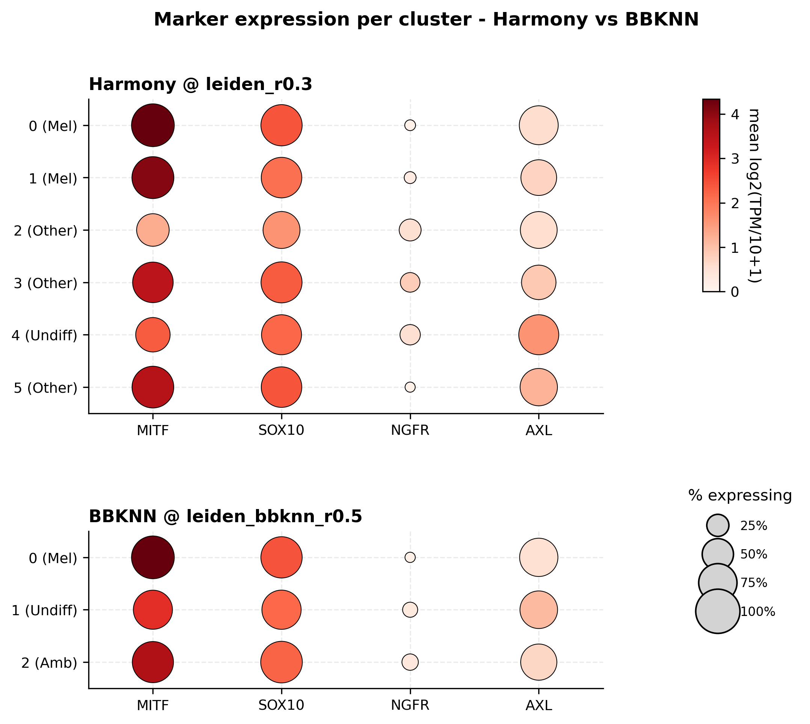
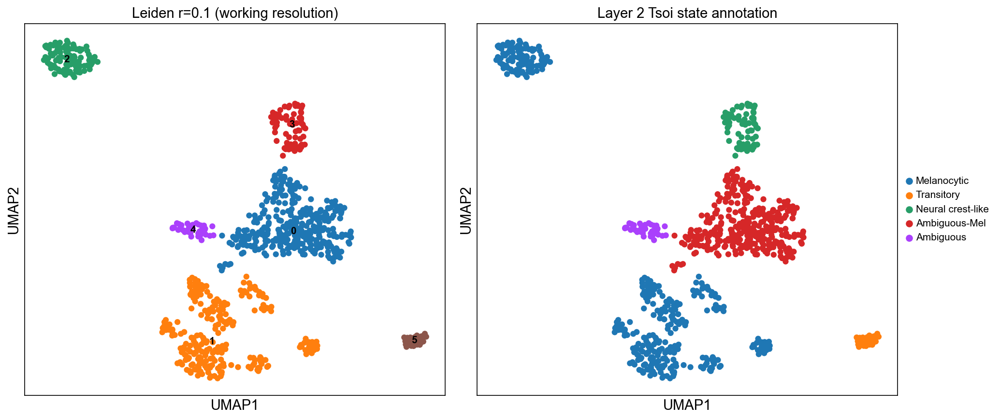
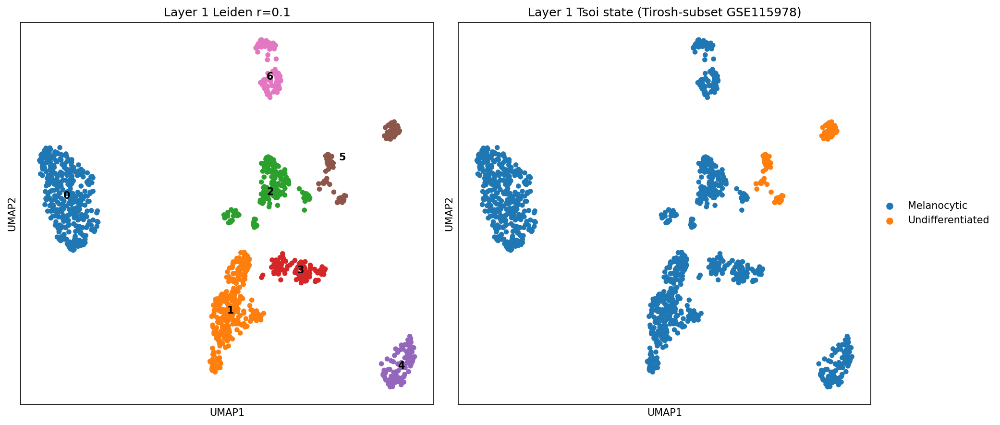

# Learning to Re-analyze: A Methodological Study of Single-Cell Integration Methods on the Tirosh et al. (2016) Melanoma Dataset

A reproducibility-focused re-analysis of the Tirosh et al. (2016) melanoma
single-cell RNA-seq dataset (GSE72056), evaluating how well classical
batch-integration methods (Harmony, BBKNN) recover the four Tsoi et al.
(2018) melanoma dedifferentiation states (Melanocytic, Transitory, Neural
crest-like, Undifferentiated). Deep-learning methods (scVI/scANVI, UCE) were
evaluated at the feasibility stage and ruled out, as their required raw
counts are controlled-access. The project is organized as a staged
investigation around a single falsifiable claim (**P1**) and its
cross-dataset test.

---

## The Research Arc

This project follows one question across four stages: **can integration
methods recover the NGFR-dependent intermediate Tsoi states (Transitory,
Neural crest-like) in melanoma malignant cells?**

- **Stage 1 — Literature grounding.** Reading notes on Tirosh 2016, Tsoi
  2018 (the four-state framework), and integration-method reviews.
- **Stage 2 — Classical pipeline.** QC → HVG → PCA → Harmony → Leiden →
  Tsoi annotation on 1,257 Tirosh malignant cells. Recovers only
  Melanocytic and Undifferentiated — two of four states.
- **Stage 3 — Cross-method comparison.** Six integration methods
  evaluated; four ruled out with documented reasons. Harmony vs BBKNN
  compared head-to-head. Both recover only the same two states and both
  fail at NC/Transitory. Because two structurally different methods fail
  identically, the limitation is elevated from a method ceiling to a
  **dataset-level** one (**P1**).
- **Stage 4 — Cross-dataset test.** P1 is tested against Jerby-Arnon 2018
  (GSE115978). A cohort-composition discovery (58% of that dataset is a
  re-annotation of Tirosh) restructures the test into layers. The result
  refines P1: the limitation is **cohort composition** — specifically the
  absence of a *dedifferentiated* tumor — not uniform NGFR suppression.

*Stage 3: across both Harmony and BBKNN clusters, no cluster shows the
NGFR-high / MITF-low signature of Neural crest-like or Transitory states
in the Tirosh malignant cells.*

---

## Key Findings

1. **Both classical methods fail identically (P1).** Harmony and BBKNN,
   despite different mechanisms, recover only Melanocytic and
   Undifferentiated — establishing the NC/Transitory gap as dataset-level,
   not method-specific.

2. **Cross-dataset: the gap is cohort composition, not uniform NGFR
   suppression.** The same pipeline on an independent cohort recovers
   Neural crest-like and Transitory; on the Tirosh tumors it does not.

| Layer 2 (independent New cohort) | Layer 1 (same Tirosh tumors) |
|---|---|
|  |  |
| Recovers NC (72) + Transitory (28)… | …only Melanocytic + Undifferentiated |

   …but 90.7% of the independent cohort's NGFR-positive cells come from a
   single tumor (Mel110), so recovery is single-tumor-driven.

3. **NGFR elevation ≠ dedifferentiation.** A Tirosh tumor (Mel81) forms
   an NGFR-elevated cluster yet retains Melanocytic identity (MITF/SOX10
   high); only Mel110, where MITF/SOX10 collapse, yields NC/Transitory.
   What Tirosh lacks is a *dedifferentiated* tumor, not NGFR signal.
   (Hypothesis-generating; n=2 informative tumors.)

Full analysis in the stage reports below.

---

## Repository Guide

**Reports (start here):**
- [`docs/stage2_report.md`](docs/stage2_report.md) — classical pipeline, two-state recovery
- [`docs/stage3_report.md`](docs/stage3_report.md) — cross-method comparison, P1
- [`docs/stage4_report.md`](docs/stage4_report.md) — cross-dataset test, P1 refinement

**Decision trail:**
- [`docs/decision_log.md`](docs/decision_log.md) — 9 entries (a–i): method exclusions, methodological pivots, framing corrections, and a documented statistical self-correction (entry i)
- [`docs/stage3_feasibility_audit.md`](docs/stage3_feasibility_audit.md), [`docs/stage4_feasibility_audit.md`](docs/stage4_feasibility_audit.md) — method-feasibility evaluations
- [`docs/stage4_dataset_schema.md`](docs/stage4_dataset_schema.md) — GSE115978 schema and the cohort-composition discovery

**Notebooks** (`notebooks/`): `00`–`09`, in analysis order. Note: two `05`
notebooks (`05_bbknn`, the adopted method; `05_seurat_rpca`, a ruled-out
alternative kept for traceability) and no `06` — numbering reflects the
project's actual decision history rather than a clean rewrite.

**Literature notes:** `docs/literature/` — Tirosh 2016, Tsoi 2018,
Balderson 2024 (a classical re-analysis benchmark), and Heumos 2023
(a single-cell best-practices review).

---

## Methodology Highlights

- **Systematic method evaluation.** Six integration methods evaluated;
  four ruled out (scVI/scANVI, UCE, Seurat RPCA/Scanorama, scGen), each
  with a decision-log entry. A trajectory method (scVelo) was separately
  ruled out for Stage 4.
- **Verification discipline.** Numerical claims were checked against
  notebook outputs before being written into reports; smoke-test scripts
  (`scripts/smoke_test/`) and dataset checksums
  (`data/jerby_arnon_CHECKSUMS.md5`) document what was tried and verified.
- **Transparent self-correction.** Decision-log entry (i) records a
  statistical over-reading (a patient/treatment confound) that was caught
  by sanity checks and corrected before any conclusion was finalized.

---

## Reproducibility & Data Access

- **Environment:** see [`environment.yml`](environment.yml).
- **Data:** raw data are not committed (gitignored). GSE72056 (Tirosh
  2016, public log-TPM) and GSE115978 (Jerby-Arnon 2018, public counts)
  are available from GEO. Raw counts / FASTQ for count-based deep-learning
  methods are controlled-access (DUOS/dbGaP), which is why those methods
  were ruled out — see the decision log.
- **Analysis logic** currently lives in the notebooks; `src/` is reserved
  for future module extraction.

---

## Status & Future Work

Stages 1 through 4 (cross-dataset C1, Layers 1–2) are complete. Deferred
as future work: Layer 3 (joint cross-cohort integration of all 7,186
cells), C2-PAGA (trajectory inference along the dedifferentiation axis),
and a definitive test on a larger multi-patient NGFR-rich cohort.

---

## License

[MIT](LICENSE)

---

## AI Collaboration & Intellectual Ownership

This project was developed with an AI-assisted workflow, using the Claude
Code CLI to help implement and document my analyses. To keep the division
of labor transparent and academically honest, the collaboration model is
defined explicitly in CLAUDE.md: *the student designs the analysis; Claude
Code implements.*

**My Role — Analysis Design & Scientific Decisions:**
All core scientific questions, biological assessments, and methodological
decisions were made independently by me. These include, but are not limited
to:

- **Data preprocessing assessment.** Independently identifying that the
  baseline Tirosh 2016 dataset was already supplied as **log2(TPM/10+1)** —
  i.e., TPM-normalized and log-transformed — and therefore deciding to
  bypass the standard normalization step to avoid double normalization and
  double log-transformation.

- **Methodological pivots & restructuring.** Decisively adjusting the
  research architecture after confirming that the **raw counts were locked
  behind DUOS controlled-access restrictions**. This led to the proactive
  exclusion of deep generative models (e.g., scVI/scANVI) and foundation
  models (e.g., **UCE**) in favor of evaluating classical integration
  methods (Harmony, BBKNN).

- **Engineering dependency evaluation.** Identifying a severe
  API-compatibility break in the **scGen** library (it emits the deprecated
  scvi-tools 0.x interface, unusable with current scvi-tools) and decisively
  ruling it out as a candidate before integration (decision-log entry f,
  2026-05-22).

**AI's Role — Implementation & Drafting Support:**
Claude Code served as an implementation and drafting assistant. It
translated my analytical specifications into concrete Scanpy code, produced
figures and documentation scaffolding, ran verification and sanity checks,
and generated commit records with Co-authored-by signatures via local Git
delegation. On occasion it also surfaced candidate interpretations of
intermediate results — for example, the treatment-effect hypothesis recorded
in **decision-log entry (i)** — but these were treated as proposals to be
tested, not conclusions. The scientific direction, every methodological
decision, and the final judgment on whether to accept or reject any
interpretation remained mine: entry (i) documents one such AI-proposed
narrative that I overturned through patient-level sanity checks before any
conclusion was finalized. Directing a capable AI — specifying the analyses,
auditing its output, and overriding it when the data demanded — was itself a
core skill this project developed.
